### Exercise 1: Data Engineering/Data Factory experience - Data ingestion from a spectrum of analytical data sources into OneLake

*Before we start executing the steps, we will open a backup Click-by-Click lab using the following hyperlink in a new tab and navigate back to the VM browser:* 

[Click-by-Click](https://regale.cloud/Microsoft/viewer/3088/modern-analytics-with-microsoft-fabric-copilot-and-azure-databricks-dream-lab-fu/index.html#/0/0)

*Now, let's trigger the Simulator App to start streaming data to EventHub (**to be used later in exercise 4**).*

Open the new tab in the browser and copy paste the below URL to verify app service streaming data.

```BASH
<inject key= "WebAppBrowse" enableCopy="true"/>
```

**Wait** for the page to load. You will see a page like the one shown below.


### Task 1.1: Create a Microsoft Fabric enabled workspace

In this exercise, you will act as the Data Engineer, Eva, to transfer Contoso's data from Azure SQL Database into the Lakehouse and initiate data preparation for the upcoming merger between Contoso and Litware Inc.

1. Open **PowerBI** in a new tab by copy pasting the below link.

```BASH
  https://app.powerbi.com/
```
`Note: After you paste the link in the browser, the page will automatically login, if the user has completed the earlier steps of Get Started instructions.`

> **Note:** Wait for the Power BI workspace to load and *close* the top bar for a better view.

8. From the left navigation pane, click on **Workspaces** and then the **+ New workspace** button.


9. Copy the below name and paste it in the **Name** field of workspace.

```BASH
 <inject key= "WorkspaceName" enableCopy="true"/>
```

>**Note:** Only use the workspace name provided above.


>**Note:** Close any pop-up that appears on the screen.


>**Note:** Wait for the Power BI Workspace to load.


### Create/Build a Lakehouse

Now, let's see how each department can easily create a Lakehouse in the Contoso workspace without any provision. They simply provide a name, given the proper access rights of course!

1. Click on the **experience** button at the **bottom left** corner of the screen (In this screenshot, **Power BI** is selected as an "Experience") and then select **Data Engineering**.


2. In the new window, under Data Engineering, click **Lakehouse**.

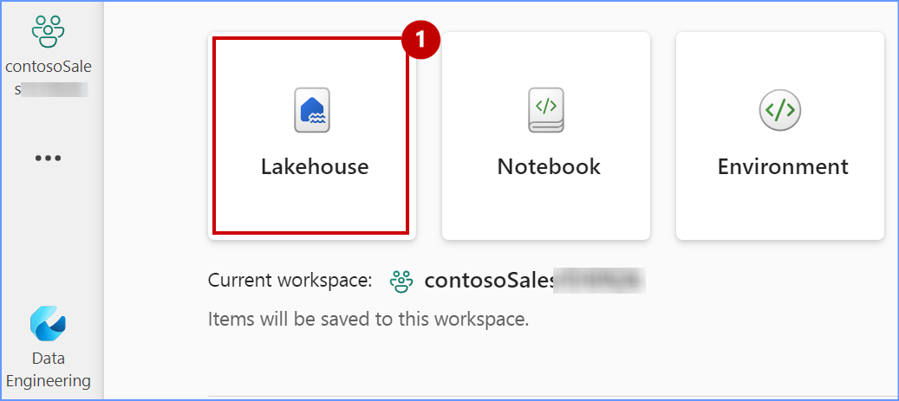

3. Paste the name **lakehouse** from the below.

```BASH
lakehouse
```

4. Click on the **checkbox** and then click on the **Create** button.

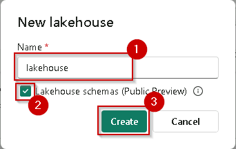

5. Expand the Lakehouse Explorer.

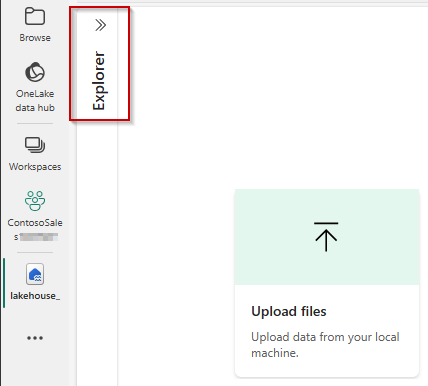

---

### Task 1.2: Use the ‘New Shortcut’ option from external data sources

Now, this is something exciting! This section shows how easy it is to create Shortcuts without moving data. That is the power of OneLake! In this exercise, you will ingest the curated bounce rate data for Litware from ADLS Gen2 using the New Shortcut option. Let’s see how!

5. Click on the **three dots (ellipses)** on the right side of Files.

6. Click on **New shortcut**.

>**Note:** Make sure you create a shortcut under **files** and not under **tables** in the lakehouse explorer pane.


7. In the pop-up window, under **External sources**, select the **Azure Data Lake Storage Gen2** source.


>**Note:** Wait for the screen to load.

8. Select **Create new Connection**

9. In the screen below, we need to enter the connection details for the ADLS Gen2 shortcut.


10. Copy the below **Data Lake Storage** endpoint and paste it in the URL field of **New Shortcut** and select **Organization account** for the **Authentication Kind**, and then Click on **Sign in**.

```BASH
<inject key= "storageEndpoint" enableCopy="true"/>
```


11. Click on your ID to complete the Sign in.


12. Click on **Next** button.


13. Select the **data** and **litwaredata** checkbox and then Click on the **Next** button.

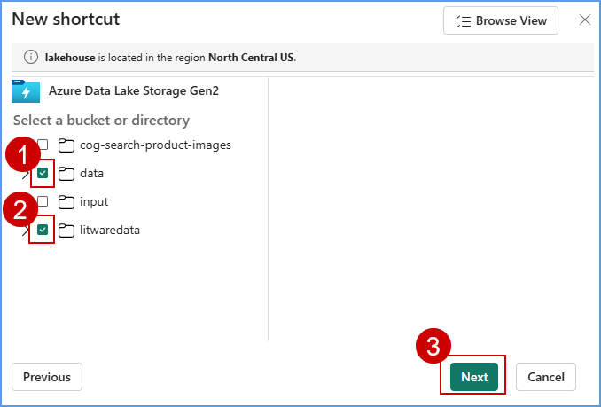

14. Click on the **Create** button.


15. And there you go! Your shortcut is now ready! Simply click (do not expand) on the newly created shortcut named **litwaredata**.


### Task 1.3: Create Delta tables using Spark Notebook

Now, let’s see how Data Engineer, Eva, got the remaining data into OneLake by creating Delta tables using Spark Notebook. By using a Spark Notebook to create Delta tables, Eva can ensure more reliable, scalable, and efficient data management, which is essential for handling big data workflows.

1. Click on **Workspace** 

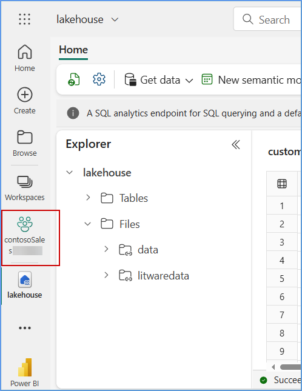

2. Click on **New Item** and then select **Notebook**


>**Note:**  If the Pop-up appears click on **Skip tour**
 
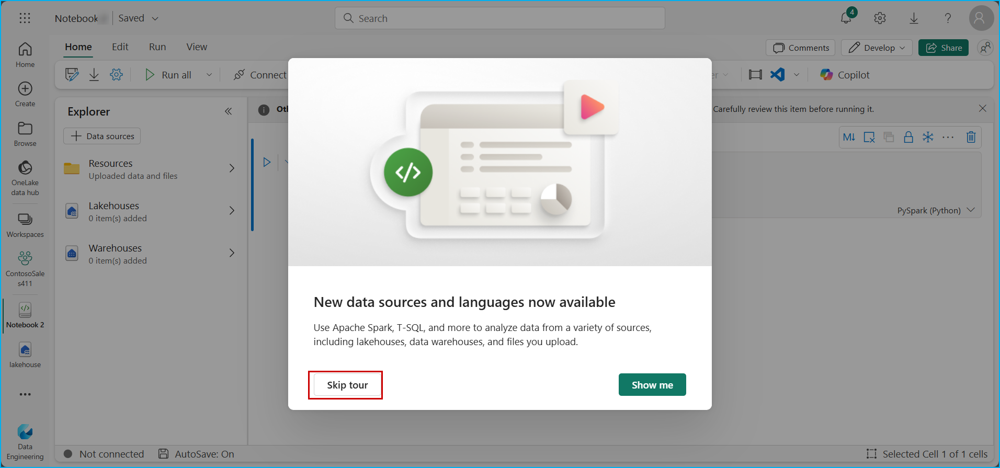  

3. Click on the **+ Data Sources** button and then select **Lakehouses**


4. Select **Existing Lakehouse with Schema** and then click on ***Add***.


5. Select the **lakehouse** and then click on **Add**

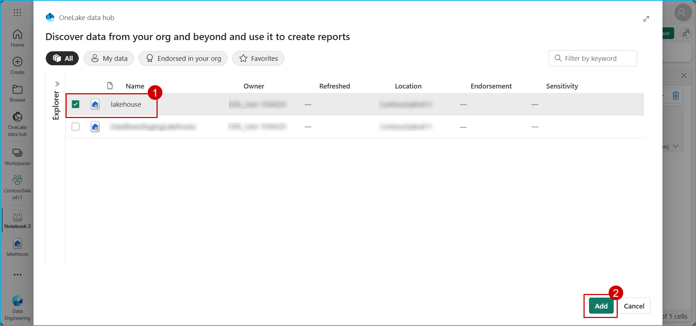

6. Once the notebook is created, paste the **below code** in the cell and **run** the cell.

```BASH
import os
import pandas as pd
 
# List all CSV files in the 'litwaredata' folder
file_path = '/lakehouse/default/Files/litwaredata/'
csv_files = [file for file in os.listdir(file_path) if file.endswith('.csv')]
 
# Load each CSV file into a table
for file in csv_files:
    table_name = file.split('.')[0]
    df = pd.read_csv(file_path + file)
    spark.createDataFrame(df).write.mode("ignore").format("delta").saveAsTable(table_name)
```


7. Once the execution is successful, **stop the Spark session** and click on **Lakehouse**.

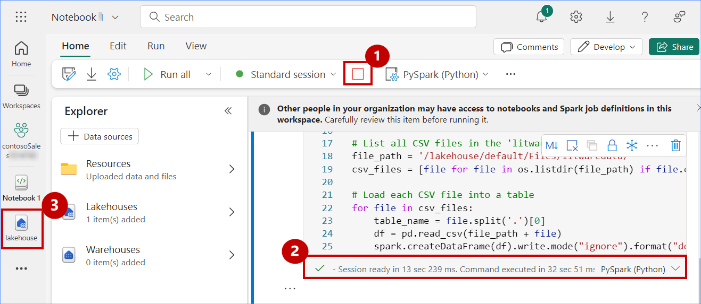

8. Expand **tables**, expand **dbo**, click on the **three dots**, and then click on **Refresh**. 

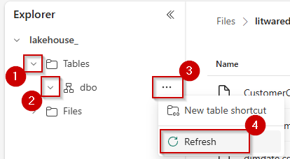

9. View the successfully **loaded tables**.


19. Click on **website_bounce_rate** delta table and view the website bounce rate data.


20. You now have all the table in **OneLake** for Contoso to leverage. Next, we proceed with data transformation using Dataflow Gen2 to transform the sales data ingested from Litware. 


### Task 1.4: Leverage Dataflow Gen2 and Data pipelines for a "No Code-Low Code" experience to quickly ingest data with Fast Copy and transform it using Copilot

Using another great feature in Fabric’s Data Factory, called Fast Copy, Contoso’s Data Engineer, Eva, quickly ingests terabytes of data with dataflows, thanks to the scalable Copy Activity in the pipeline. With so much data from Litware, there is bound to be a lot of clean up needed. Let’s step into Eva’s shoes to explore how she used fast copy to ingest data and Copilot to transform it, just in time to derive meaningful customer insights before their big Thanksgiving Sale!

You will experience how easy it is to use Fast Copy to transform 100M rows 0f Litware's sales data into the Lakehouse.

1. Click on the **experience** button at the **bottom left** corner of the screen (In this screenshot, **Data Engineering** is selected as an "Experience") and then select **Data Factory**.

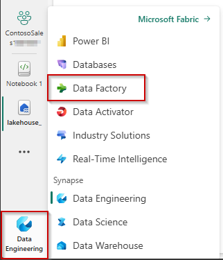

2. Click on **Dataflow Gen2**.

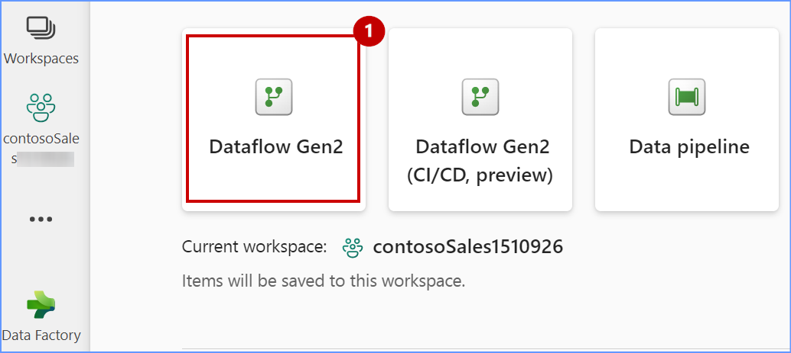

3. Click on the drop down of the **New Query** icon and click on the **Get data**.

   Note: If **New Query** is not visible due to the screen resolution, please click directly on top part of the **Get data**.

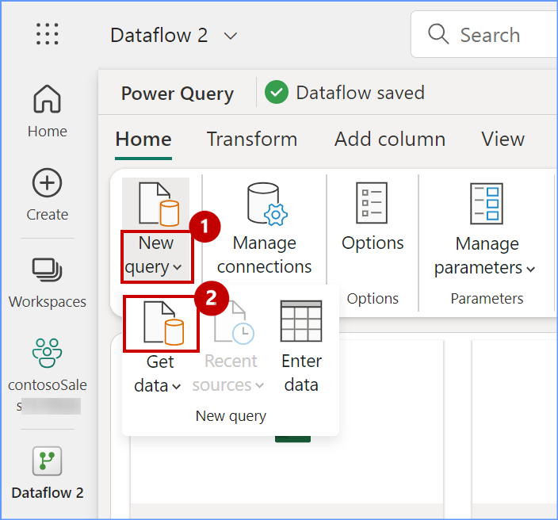

4. In the pop-up window, scroll down to **OneLake data hub** and click on **lakehouse**.


5. If you see a screen similar to the one shown below, click on the **Next** button otherwise move to the next step.


6. Expand **lakehouse**, expand **Files** and expand **data** then scroll down.

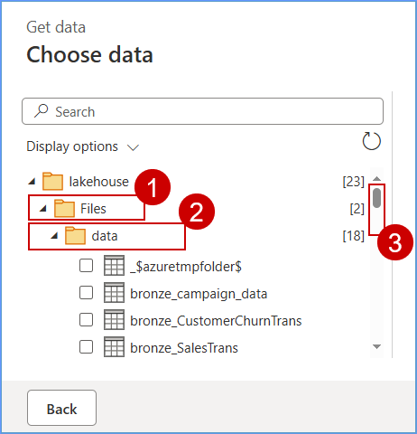

7. Select the **sales_data.csv** checkbox, then **click** on the **Create** button.

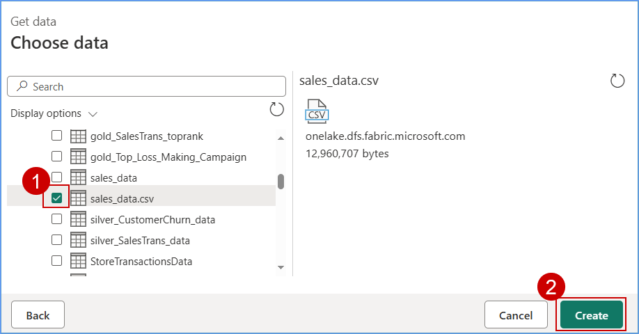

8. Collapse the **Queries** pane and take a look at the sales dataset (**note that the first row of this dataset is not a header**).


> **Let's use Copilot to perform data cleansing.**

9. Click on the **Copilot** button, paste the **prompt** provided below in the following text box and click on the **send** icon.

```BASH
  In the table sales_data csv, apply first row as headers.
```


>**Note:** If Copilot needs additional context to understand your query, consider rephrasing the prompt to include more details.

10. Scroll to the right hand side and observe the **GrossRevenue** and **NetRevenue** columns. You'll notice the there are some empty rows with null values.


> **Let's use Copilot to remove empty rows.**

11. Similarly, paste the prompt below in Copilot and click on the **send** icon.

```BASH
Remove empty rows from GrossRevenue and NetRevenue columns.
```
12. Scroll to the right hand side and observe the **GrossRevenue** and **NetRevenue** columns (**there are no empty rows with null values**).


>**Note:** Due to time constraints, we will not publish and run the Dataflow from the Pipeline.

>**Note:** Expand the queries pane collapsed earlier.

13. Right click on the **query** and then select **Require fast copy**.

  

14. Click on **Options**, scroll down to select **Scale** and then select **Fast copy**.

 

15. Click on **Add destination**, select **Lakehouse**.
  
  Note: If **Add destination** is not visible, click on **Query** dropdown and click on **Add destination** to select "Lakehouse" 

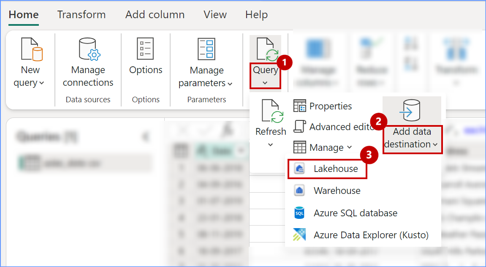 

16. Select the connection and click on **Next** button.

   

17. Expand Lakehouse, expand the workspace **ContosoSales...**, then select **lakehouse**.

18. Enter the table name as **sales_data_updated** and then click on the **Next** button.

   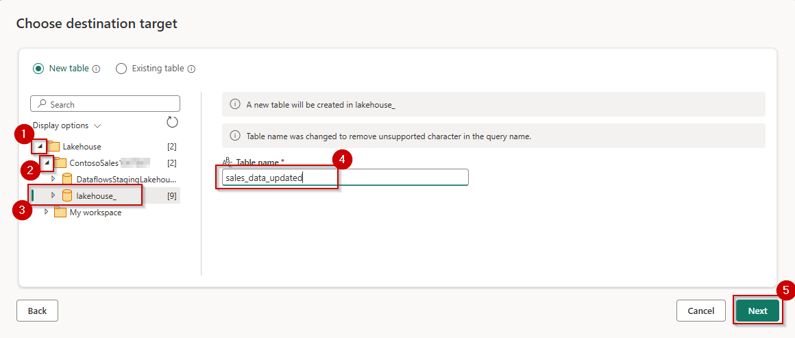 

18. Click on the **Save settings** button.

 

19. Click on the **Publish** button.


Congrats on completing this data transformation exercise! Looking at that, it took just 10 minutes to copy 100 million records. 

As you know, Litware was primarily using Azure Databricks with their data stored in ADLS Gen2 before the acquisition. Post merger, as one unified company – Contoso – they decided to leverage Azure Databricks to build and manage reliable data pipelines via Delta Live Tables (DLT). Now, you will see the amazing power of Unity Catalog that Contoso’s data architects used to quickly learn all about Litware's data without having to go through tons of documents. And all by simply leveraging AI and data intelligence.


### Task 1.5: Explore Task Flows in Microsoft Fabric

To streamline collaboration and project management for the entire team, IT admin Chou set up a task flow within the Microsoft Fabric workspace. Fabric task flow is a workspace feature that enables you to build a visualization of the workflow in the workspace. It helps you understand how items are related and work together, making it easier to navigate your workspace, even as it becomes more complex over time. 
In this exercise, you’ll step into the shoes of each of the IT admins to see how easy it is to set up a task flow in Microsoft Fabric.

1. Click on workspace **ContosoSales...** and drag the **bar down** to view Taskflow feature tab.
  
  
  
2. Click on the **Select a predesigned task flow** , 

  

3. Select **Medallion**, and then click on the **Select** button.

  

4. The empty Task Flow is created successfully.

  

5. Click on the **attach** icon on the Bronze data tile.

   Note: Please zoom in, if the tiles are not visible.

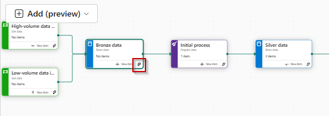

6. Select the lakehouse **checkbox** and then click on the **Select** button.

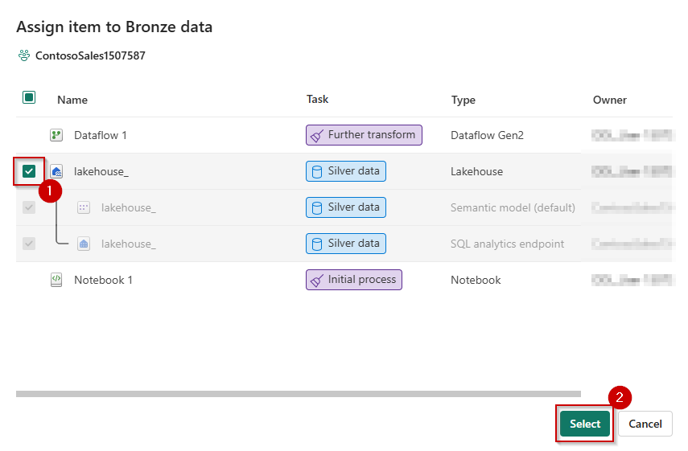

7. Click on the **attach** icon on the Initial process tile.

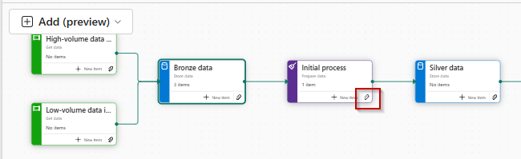

6. Select the lakehouse **checkbox** and then click on the **Select** button.

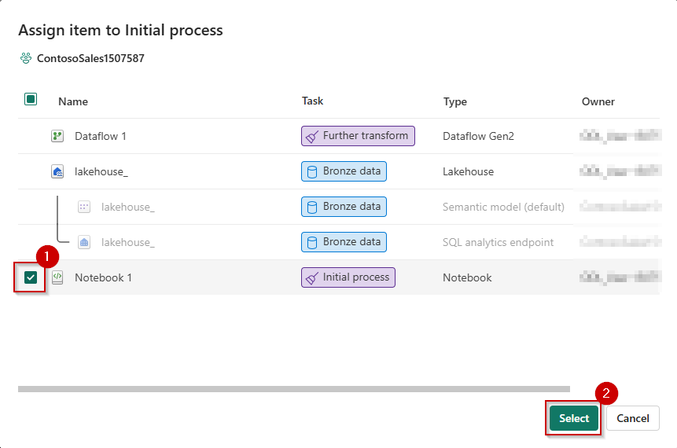
