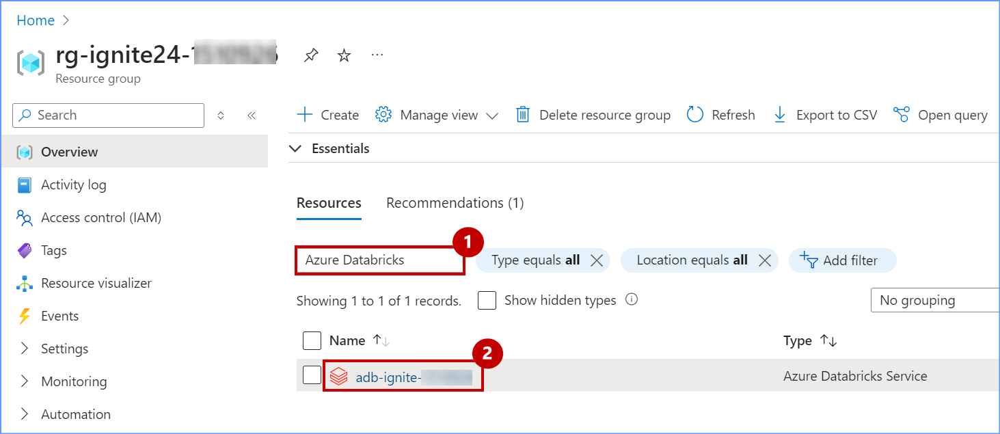
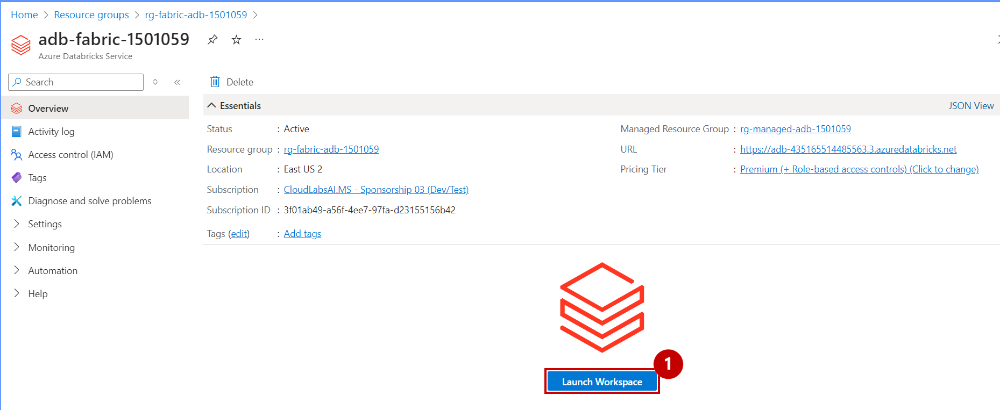
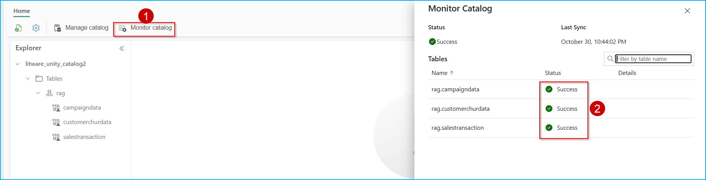

### Exercise 2: DLT Pipelines-Unity Catalog for Data governance, Metastore experience Retrieval Augmented Generation and Machine Learning

This exercise shows how Microsoft Fabric with Databricks enabled Contoso to solve their integration challenges. The acquired company, Litware Inc., was already using Databricks heavily and they stored their churn and sales data in ADLS Gen2. We’ll see how Unity Catalog benefited Contoso’s data architects so they could quickly get up to speed on all Litware Inc.’s data.

### Task 2.1: Explore Delta Live Table pipeline (Data Transformation)

Delta Live Tables (DLT) allow you to build and manage reliable data pipelines that deliver high-quality data in Lakehouse. DLT helps data engineering teams simplify ETL development and management with declarative pipeline development, automatic data testing, and deep visibility for monitoring and recovery.

1. Go back to the azure portal, Resource Group that mentioned below.

```BASH
 <inject key= "resourcegroup" enableCopy="true"/>
```

2. Search for the Azure Databricks in the Resource group search field.

  

3. Click on the **Launch Workspace**.

 

4. Click on the **Sign in with Microsoft Entra ID**.


5. Scroll down in the left navigation pane and click on **Delta Live Table**.


6. Click on the **Create pipeline** button.


7. Enter the name of the pipeline as **"DLT_Pipeline"** , scroll down to the **Paths** and click on the **file icon** to browse the notebook.

```BASH
DLT_Pipeline
```


8. Click on **Shared**, click on **Analytics with ADB**, click on the **01 DLT Notebook** and then click on the **Select** button.

  

9. Click on the **Create** button.

  

>**Note**: Do not click on the **Start** button. Due to time constraints, We will not be executing this pipeline.

10. If we were to execute it, we would see a result similar to the one in the following screenshot. Click on the screenshot for a better view.

  


---

### Task 2.2: Explore the data in the Azure Databricks environment with Unity Catalog (unified governance solution for data and AI).

We saw how Contoso utilized DLT pipelines to create a Medallion architecture on their data. Now let’s look at how data governance was managed on this curated data across the organization and made easy with Unity Catalog.
 
With the acquisition of Litware Inc., Contoso had a lot of data integration and interoperability challenges. They wanted to make sure that the transition was smooth, and their data engineers and data scientists could easily assimilate the data processed by Databricks. Thankfully, they were able to leverage Gen AI features right within Azure Databricks to understand and derive insights from this data.

>**Note**: Due to time constraints, the following steps will be completed via an online Click-by-Click exercise.

>Please follow the green beacons for this exercise.
- This exercise will be performed outside the VM browser.
- Please return back to the VM browser once you see the **End of Task 2.2** screen.
- Once you press the **Agree** button, press the **A** key on your keyboard if you do not see the annotations.
	
1. Click on the [**hyperlink**](https://regale.cloud/Microsoft/viewer/3066/task-22-explore-the-data-in-azure-databricks-environment-with-unity-catalog/index.html#/0/1)

2. Continue with next excercise.

### Task 2.3: Create mirrored Azure Databricks catalog in Fabric and analyze data using T-SQL

Mirroring the Azure Databricks Catalog structure in Fabric allows seamless access to the underlying catalog data through shortcuts. This means that any changes made to the data are instantly reflected in Fabric, without the need for data movement or replication. Let’s step into Data Engineer, Eva’s shoes to create a Mirrored Azure Databricks Catalog and analyze the data using T-SQL. 

1. Navigate back to the Microsoft Fabric tab on your browser 
```BASH
https://app.powerbi.com/
```

2. Go to the **<inject key= "WorkspaceName" enableCopy="true"/>** and select **New item** from menu bar.

   Note: If the  <inject key= "WorkspaceName" enableCopy="false"/> workspace is not found in the sidebar, click on Workspace and navigate to **<inject key= "WorkspaceName" enableCopy="true"/>**

  

3. In the **New item** window, scroll down and click on **Microsoft Azure Databricks catalog (preview)**.


4. A **New source** window pops up. Select the **Create new connection** radio button.


5. In the URL field of the connection string, copy paste the provided URL below.

```BASH
 <inject key= "databricksurl" enableCopy="true"/>
```

6. Now, select **Service principal** from 'Authentication kind' dropdown box, and enter the following details.

- Tenant ID: 

```BASH
<inject key= "TenantID" enableCopy="true"/>
```
- Service principal client ID: 

```BASH
<inject key= "ClientID" enableCopy="true"/>
```

- Service principal Key:

```BASH
<inject key= "Secret" enableCopy="true"/>
```

7. click on the **Connect** button.


8. Click on **Next** button.


9. In the **Choose data** screen, select the **Catalog name** from the dropdown box, and select the tables to be mirrored into Fabric, then select the checkbox **Automatically sync future catalog changes for the selected schema** to mirror future tables and click on **Next** button.


10. Enter the **Artifact name** for your mirrored Databricks Catalog and click on **Create** button.


11. Click on **Monitor catalog** button to track the mirroring status.



12. Click on the **View SQL endpoint** button. You can also select the tables to preview data.


