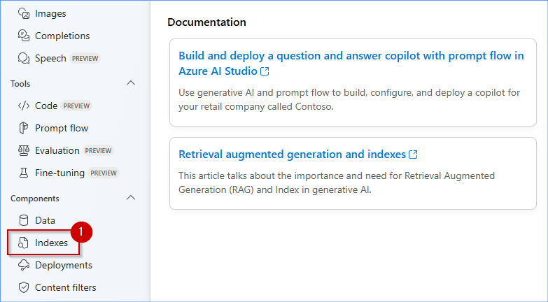
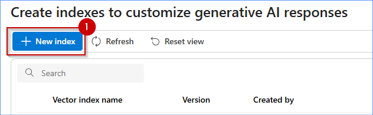
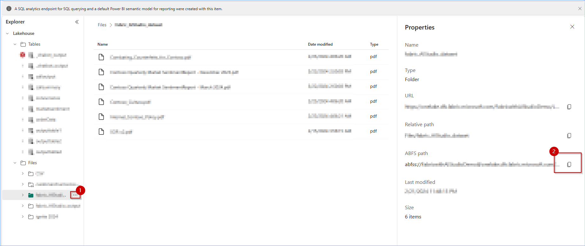
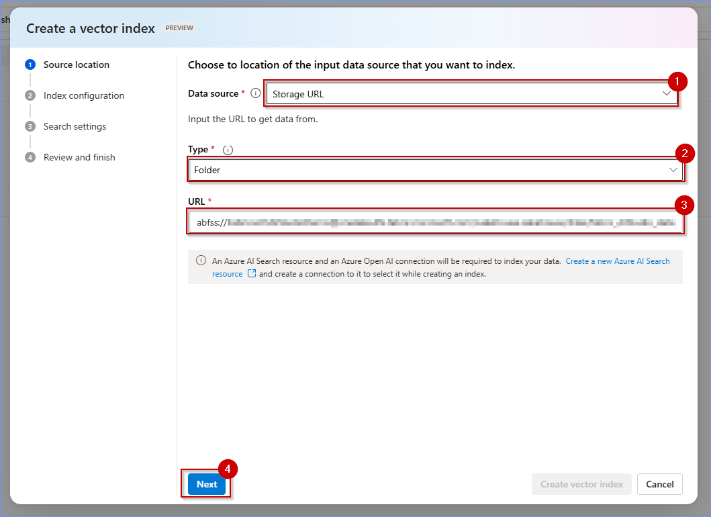
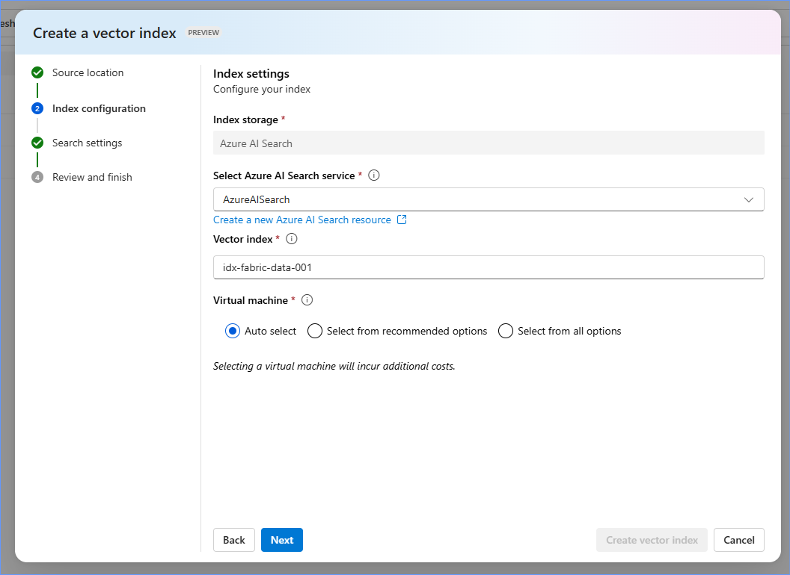
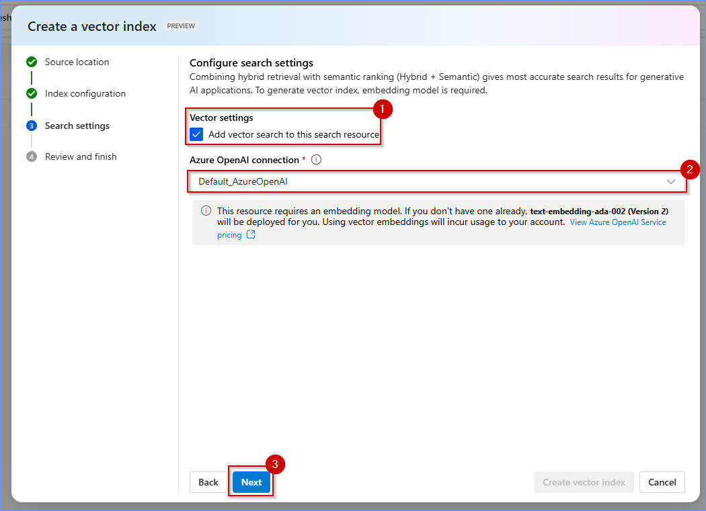
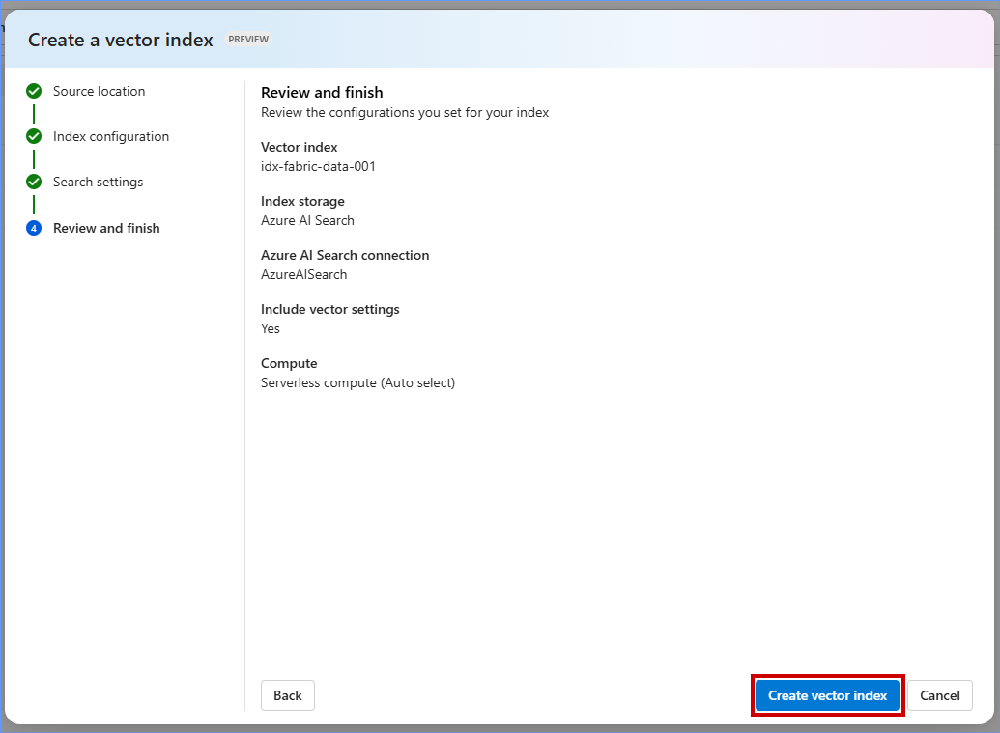
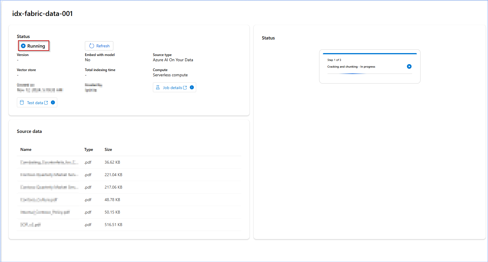
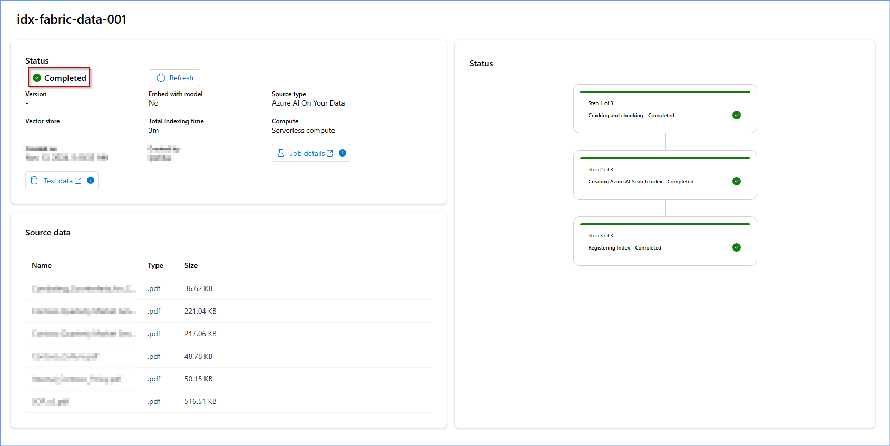

## Exercise 3: Building an AI-Powered Enterprise Chatbot with Microsoft Fabric and Azure AI Studio

### Task 3.1 :  Setting up Azure AI Studio

1. Go back to the Azure Portal and Resource Group <inject key= "resourcegroup" enableCopy="false"/>

2. Search **hub** then select <inject key= "hub" enableCopy="false"/>.


	
3. Click on the **Launch Azure AI Studio** button.  


4. To connect with Fabric data go to **Indexes** from the left navigation pane.



5. From the Indexes page, click on **+ New Index**



6. In a new tab, open Fabric workspace and navigate to the folder where your files are stored. Click on the 3 dots beside the folder and copy the URL.



7. Navigate back to Azure AI Studio. From Data Source dropdown select **Storage URL**. In Type select **Folder** and paste the URL. Click Next.



8. In **Select Azure AI Search service** select the default AI Search or the AI Search service you want to use. Give a meaningful name to the index. For virtual machine select **Auto Select**. Click Next.



9. In Next page check the option of adding vector,this allows Hybrid search. Select your preferred OpenAI connection and click Next.



10. Review your vector settings and click **Create Vector Index**.



11. Your index is being created, wait for the Result to show Completed. This step takes approximately 7 to 9 minutes.



12. Your documents from Fabric are now indexed.




### Task 3.2 : Integrating Azure OpenAI to refine search results and deliver more precise, context-aware answers to users.

1. In Azure AI hub, select **Connections** from the left navigation pane and click on the **+ New Connection** button.

   Note: If the left side bar is collapsed, please click on **expand** from the above of the **left side bar**.


	
2. Select **Azure OpenAI Service**.


3. You will find two Azure OpenAI resources. Create a connection with both by clicking on the **Add connection** button.


4. Once the **OpenAI services are connected**, click on **Back to select an asset type**.


5. Select **Azure AI Search**.


6. Click on **Add connection**.


7. Once the **AI Search is connected**, click on the **Close** button.

Note: If the **close** button is not visible, please reduce the screen size of the browser.


8. Here it is Azure Open AI and Azure AI Search Connections.


9. Click on **All projects** in the left navigation pane and select the **pre-created Project** displayed on your screen.
  


### Task 3.3 : Indexing data in Azure AI Studio, enabling efficient search and retrieval based on user queries.

1. Scroll down in the left navigation pane, click on **Indexes** and then click on the **+ New index** button.


2. In the Data source dropdown, select **Azure AI search**.


3. Click on the **Next** button.


4. In the Select Azure AI Search service dropdown, select **existing Azure AI Search service**.

5. In the Select Azure AI Search index dropdown, select **cosmosdb-index** and then click on the **Next** button.


5. In the Azure OpenAI connection dropdown, select **openAI2...**  and then click on the **Next** button.


6. Click on the **Next** button.


7. Click on the **Create vector index** button.


>*Please wait for the index to load*

8. It will show a screen somewhat similar to the screenshot below with text as **Index not found**, don't confuse, wait for some time and click on **Indexes**.


9 . Check the Status shown as **Ready** and continue with the next task.


### Task 3.4 : Deploying and testing a Prompt flow to automate query handling, ensuring quick and optimized responses.

1. Click on **Prompt flow** from the left navigation pane and then click on the **+ Create** button.


2. Scroll down and click on the **Upload** button in the Upload from local section.


3. Click on the **Zip file** radio button and then click on **Browse**.


4. Navigate to the path **C:\LabFiles\01_Pre_Day\artifacts\aistudio**, by clicking on the **browse** button.

5. Click on **shopping-assistant-prompt-flow** and then click on the **Open** button.

   

5. In the Select flow type dropdown, select **Chat flow** and then click on the **Upload** button.


>**Note:** If clicking on the upload button doesn't redirect you to the Prompt flow screen, click on the Upload button and retry. You might need to do this for twice or thrice.

6. Click on the **Start compute session** button.

**Note:** It will take approximately 2-3 minutes to start the compute session. Please wait for some time.


7. Scroll down to the **lookup** section in the Prompt flow graph and click on it.

8. Click on the **Validate and prase input** button.

9. Once it is validated, click on edit option for **mlindex_content** as shown in the below screenshot.


8. Click on the **acs_index_connection** dropdown and select the **srch....**.

8. Click on the **acs_index_name** dropdown and select the **cosmosdb-index**.

8. Click on the **embedding_type** dropdown and select the **Azure OpenAI**.

8. Click on the **aoai_embedding_connection** dropdown and select the **openAI2...**.

9. Click on the **Save** button.


9. Click on **prompt_for_looks** in the Graph and then click on the **Validate and prase input** button in the Input sections. 


10. Once it is validated, click on the **Connection** dropdown and then select **openAI...**.


11. Click on the **Chat** button.


12. Paste the **below question** in chat box replacing the default question.

```
Can you show me some yellow indian dresses for a wedding in Udaipur?
```
13. Click on the **send** icon.


13. Observe the **response**.


Once the Prompt flow is deployed as an endpoint, It can be consumed in the webapplication. Let's see how the response look like in the webapp.
 
14. Copy the below URL and paste it in the browser new tab.

```BASH
<inject key= "shoppingcopilotwebapp" enableCopy="false"/>
```

15. Click on the **terms and conditions checkbox** and then click on the **Login** button.


 
18. Click on the **Copilot icon** at the bottom right of the page.
 


19. Click on any of the **pre-populated questions**.
 

 
20. Observe the **response**.
  

 
