### Exercise 6: Explorer Data Science experience in Microsoft Fabric (Optional)
 
Microsoft Fabric offers Data Science experiences to empower users to complete end-to-end data science workflows for data enrichment and business insights. You can complete a wide range of activities across the entire data science process, all the way from data exploration, preparation and cleansing to experimentation, modeling, model scoring and serving predictive insights to BI reports.

### Task 6.1: Build ML models and experiments using Copilot in Fabric


To understand the cause behind Contoso’s declining revenue, the team needed to dive deeper into their customers’ spending pattern.

Copilot responds to queries in natural language or generates customized code snippets for tasks like creating charts, filtering data, applying transformations, and building machine learning models.

Let’s see how Copilot for Notebook helps you, as a Data Engineer, quickly create Data Science Notebooks.

1. Switch to the **Data Science** experience using the experience switcher icon in the left corner.

   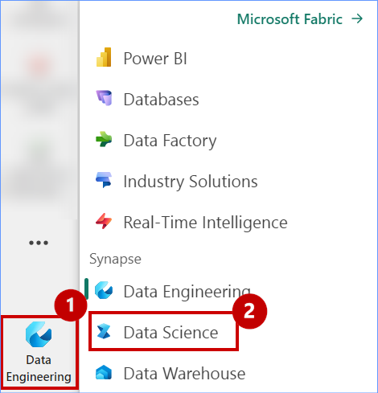

2. Click on Import notebook.

   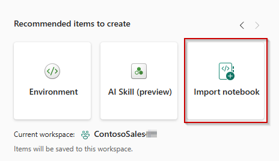

3. Click on the **Upload** button.

   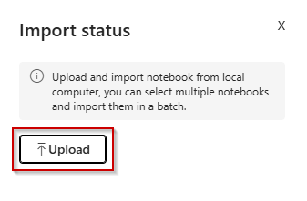

4. Browse to the fabricnotebooks folder "C:\LabFiles\01_Pre_Day\artifacts\fabricnotebooks" in the VM and select **Build ML models and experiments using Copilot for Data Science in Fabric** notebook.

5. Click on the **Open** button.

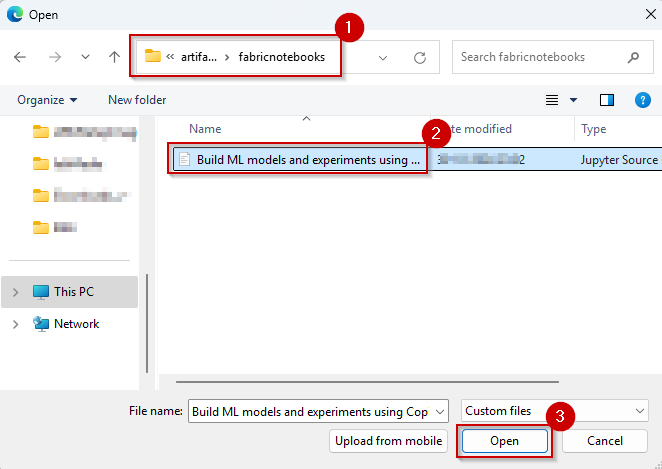

6. Wait for the notebook to **upload**.

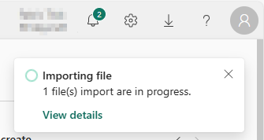

7. Click on the **ContosoSales...** workspace from the left navigation pane.

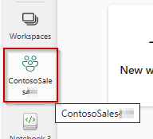

8. Click on **Filter**, expand **Type** and select **Notebook**.

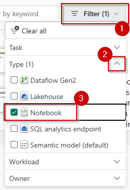

9. Click on the **Build ML models and experiments using Copilot for Data Science in Fabric** notebook.

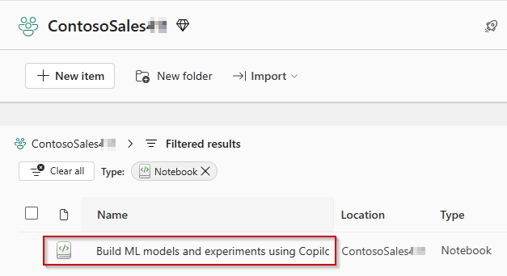

10. Click on **Lakehouses** in the Explorer pane.


11. Click on **Missing Lakehouses** and then click on **Remove all Lakehouse**.

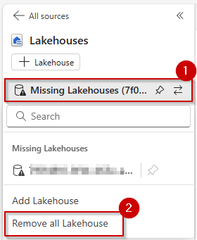

12. Click on the **Continue** button.

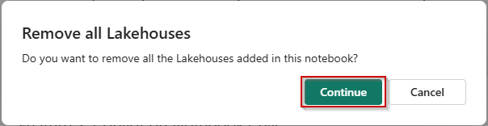  

13. Click on the **+ Lakehouse** button.

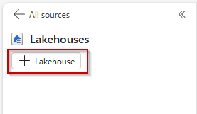 

14. Make sure that **Existing Lakehouse with Schema** radio button is selected and then click on the **Add** button.

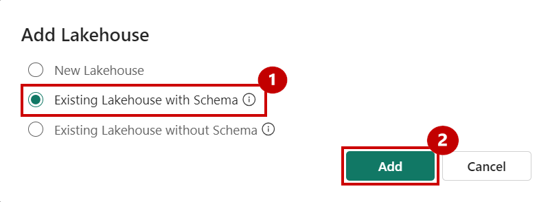

15. Select the **lakehouse** checkbox.

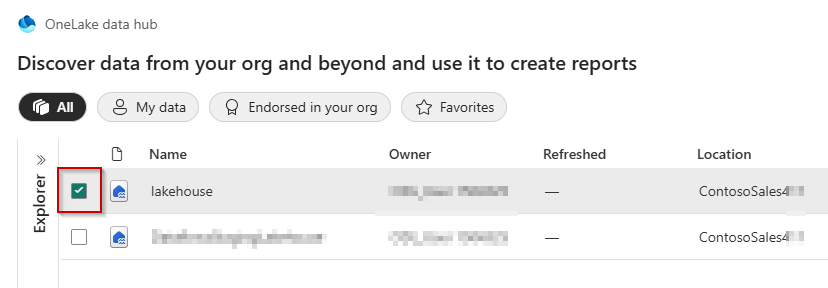

16. Click on the **Add** button.

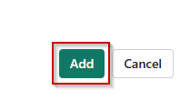

17. Click on the **Copilot** button and then click on the **Get Started** button.
 
 Note: If the Copilot is not visible please click on eclipse **:** and select Copilot.

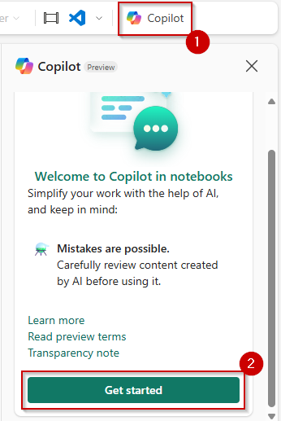

18. Run the **first cell** of the notebook to install the copilot packages.

>**Note:** This may take a while to execute, please wait till this load completely.

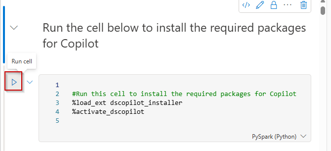

19. Copy and paste the **below prompt** in the textbox.

```
Load the "customerchurndata" table from the lakehouse into a Spark DataFrame. Then convert that into pandas dataframe as df
```

20. Click on the **send** button.

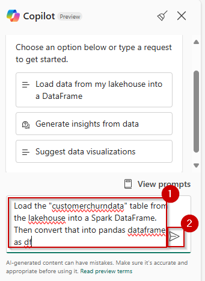

21. Click on the **Copy code** icon.

>**Note:** The new cell will be created right above the cell.

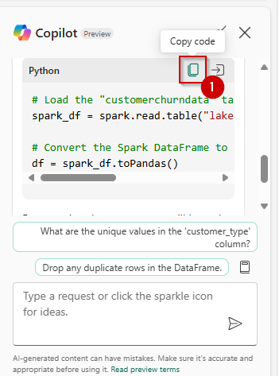

22. Click on a **+ Code** above the first cell of the notebook.

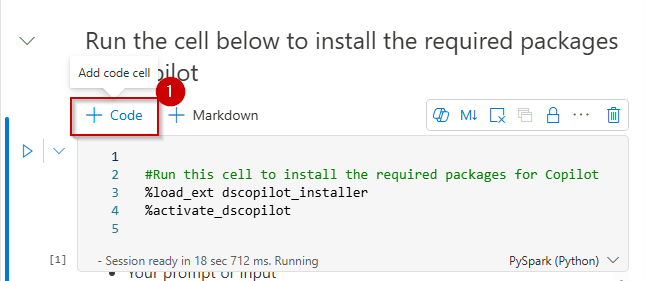

23. Paste the **copied query** and run the new **cell**.

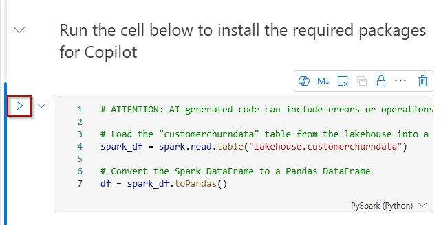

24. Paste the following at the **end of your browser URL** and press the **Enter** key. 

```
&debug.enableCopilot=1&debug.enableChatWidget=1&debug.enableQuickAssist=1
```

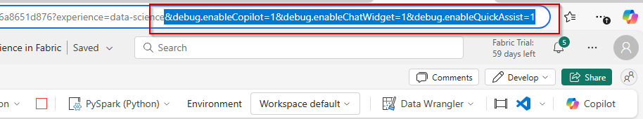

25. Click on a **+ Code** above the cell, place your **cursor** in the cell and then click on the **Copilot** button.

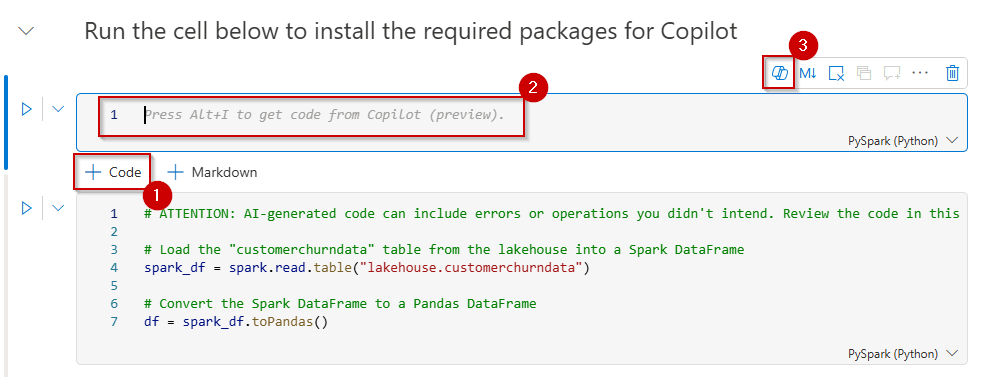

26. Enter the below prompt in the Copilot textbox: 

```
Create a pivot table of average with min and max total amount by store contract and churn. Then show output of the pivot table.
```

27. Click on the **Send** icon.

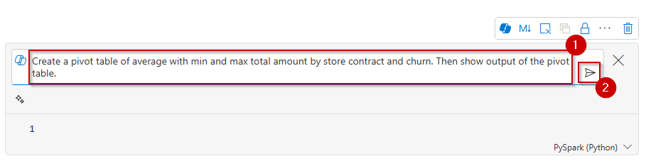

28. Click on the **Accept** button.

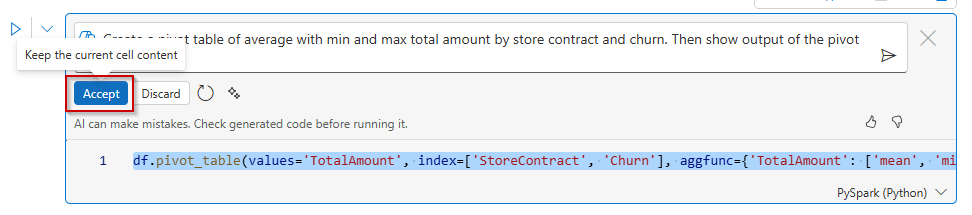

29. Run the cell and observe the output.

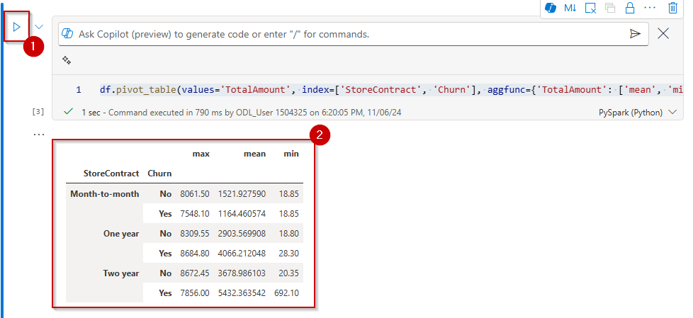

30. Add a **new code cell** to the notebook, paste following **query** to the cell and then run the **cell**.

```
%%chat 
Create a seaborn scatterplot with Tenure Total Amount and Churn
```

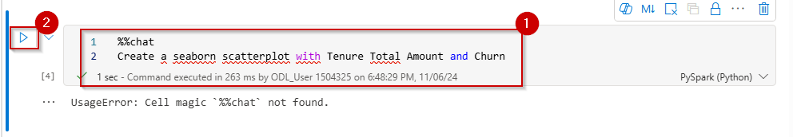

31. Introduce an error in a previous cell by **removing a character** in the code.

32. Run the **code cell** with the error.

33. Click on **Fix with copilot**.


With the data prepared with the help of Copilot, Data Scientists like you can explore the data to understand the patterns it contains.

The rest of the notebook has similar PySpark queries to explore customer churn prediction.


### Task 6.2: Leverage AI skills for Q&A

AI Skill, a new capability in Fabric, allows Data Analysts like Serena to create their own generative AI experiences. Serena believes that generative AI offers a transformative way to interact with data, significantly boosting data-driven decision-making in organizations worldwide. 

In this exercise, you’ll step into Data Analyst, Serena’s shoes and leverage AI Skill to create conversational question-and-answer (Q&A) systems. 

1. From the left navigation pane select **Data Science** experience.


2. Click on **>** Forward Arrow and select **AI Skill**.


3. Enter Name as **Contoso-Assistance** 


4. Click on **lakehouse** and then click on the **Confirm** button.


5. Click on **refresh** and Expand **Tables** then select the following tables.

- dimcustomer
- dimdate
- dimproduct
- dimreseller
- factinternetsales
- factresellersales


6. Click on **Get Started**.


8. Type **What is the most sold product?** in the chatbox and click on the **Send** button.


9. AI Skill answered the question fairly well based on the selected tables.

However, the SQL query needs some improvement, it orders the products by order quantity, when total sales revenue associated with the product is the most important consideration, as shown in the above screenshot.

To improve the query generation, let's provide some instructions, as shown in these examples:

```
Whenever I ask about "the most sold" products or items, the metric of interest is total sales revenue and not order quantity.

The primary table to use is FactInternetSales. Only use FactResellerSales if explicitly asked about resales or when asked about total sales.
```

10. Copy the above notes and paste it in **Notes for model** box. Type **What is the most sold product ?** in the chatbox and then click on the **Send** button.  

Asking the question again returns a different answer, **Mountain-200 Black, 46**, as shown in the below screenshot:


In addition to instructions, examples serve as another effective way to guide the AI. If you have questions that your AI skill often receives, or questions that require complex joins.

11. In the example SQL queries click on **edit** icon.


12. Click on **+ Add example** and enter the following question and their respective SQL queries.

|Question| SQL query|
|--------|----------|
|who are the top 5 customers by total sales amount?|SELECT TOP 5 CONCAT(dc.FirstName, ' ', dc.LastName) AS CustomerName, SUM(fis.SalesAmount) AS TotalSpent FROM factinternetsales fis JOIN dimcustomer dc ON fis.CustomerKey = dc.CustomerKey GROUP BY CONCAT(dc.FirstName, ' ', dc.LastName) ORDER BY TotalSpent DESC;|
|what is the total sales amount by year?|SELECT dd.CalendarYear, SUM(fis.SalesAmount) AS TotalSales FROM factinternetsales fis JOIN dimdate dd ON fis.OrderDateKey = dd.DateKey GROUP BY dd.CalendarYear ORDER BY dd.CalendarYear;|


13. Click on **close(X)** button.


14. Type  the below prompt in the chatbox and click on **Send** button.

```
who are the top 5 customers by total sales amount?
```


15. Click on **Publish** button.


16. In the pop-up screen click on **Publish** button.


17. Notice that AI skill is published successfully.


