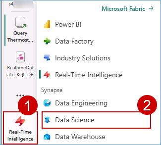

### Exercise 6: Explorer Data Science experience in Microsoft Fabric
 
Microsoft Fabric offers Data Science experiences to empower users to complete end-to-end data science workflows for data enrichment and business insights. You can complete a wide range of activities across the entire data science process, all the way from data exploration, preparation and cleansing to experimentation, modeling, model scoring and serving predictive insights to BI reports.

### Task 6.1: Build ML models and experiments using Copilot in Fabric


To understand the cause behind Contoso’s declining revenue, the team needed to dive deeper into their customers’ spending pattern.

Copilot responds to queries in natural language or generates customized code snippets for tasks like creating charts, filtering data, applying transformations, and building machine learning models.

Let’s see how Copilot for Notebook helps you, as a Data Engineer, quickly create Data Science Notebooks.

1. Switch to the **Data Science** experience using the experience switcher icon in the left corner.

   

2. Click on **Import notebook** button.

   

3. Click on the **Upload** button.

   

4. Browse to the fabricnotebooks folder **"C:\LabFiles\01_Pre_Day\artifacts\fabricnotebooks"** in the VM and select **Build ML models and experiments using Copilot for Data Science in Fabric** notebook.

5. Click on the **Open** button.


6. Wait for the notebook to **upload**.


7. Click on the **<inject key= "WorkspaceName" enableCopy="false"/>** workspace from the left navigation pane.


8. Click on **Filter**, expand **Type** and select **Notebook**.


9. Click on the **Build ML models and experiments using Copilot for Data Science in Fabric** notebook.


10. Click on **Lakehouses** in the Explorer pane.


11. Click on **Missing Lakehouses** and then click on **Remove all Lakehouse**.


12. Click on the **Continue** button.

  

13. Click on the **+ Lakehouse** button.

 

14. Select **Existing Lakehouse with Schema** and then click on the **Add** button.


15. Select the **lakehouse** checkbox.


16. Click on the **Add** button.


17. Click on the **Copilot** button and then click on the **Get Started** button.
 
>**Note:** If the Copilot is not visible please click on eclipse **":"** and select Copilot.


18. Run the **first cell** of the notebook to install the copilot packages.

>**Note:** Note: This may take a while to execute, please wait till this loads completely as seen by the **Play button** becoming visible again.


19. Copy and paste the following **prompt** in the textbox.

```
Load the "customerchurndata" table from the lakehouse into a Spark DataFrame. Then convert that into pandas dataframe as df
```

20. Click on the **send** button.


21. Click on the **Copy code** icon.

>**Note:** The new cell will be created right above the cell.


22. Hover above the first cell and then click on a **+ Code** icon.


23. Paste the copied **query** and run the new **cell**.


>**Note:** Copilot may not respond as expected, please copy and paste the following code to obtain the result:

```
# Load the table into a Spark DataFrame
spark_df = spark.table('lakehouse.customerchurndata')
 
# Convert the Spark DataFrame to a pandas DataFrame
df = spark_df.toPandas()
```

>**Note:** It may take some time for the copilot to generate query.

With the data prepared with the help of Copilot, Data Scientists like you can explore the data to understand the patterns it contains.

The rest of the notebook has similar PySpark queries to explore customer churn prediction.


### Task 6.2: Leverage AI skills

AI Skill, a new capability in Fabric, allows Data Analysts like Serena to create their own generative AI experiences. Serena believes that generative AI offers a transformative way to interact with data, significantly boosting data-driven decision-making in organizations worldwide. 

In this exercise, you’ll step into Data Analyst, Serena’s shoes and leverage AI Skill to create conversational question-and-answer (Q&A) systems. 

1. From the left navigation pane select **Data Science** experience.


2. Select **AI Skill**. If it is not visible, scroll down the page.


3. Enter Name as **Contoso-Assistance**  as the Create AI Skill name.


4. Click on **lakehouse** and then click on the **Confirm** button.


5. Click on **refresh** and Expand **Tables** then select the following tables.

- dimcustomer
- dimdate
- dimproduct
- dimreseller
- factinternetsales
- factresellersales


6. Click on **Get Started** button.


7. Past the following question **What is the most sold product?** in the chatbox and click on the **Send** button.

```
What is the most sold product?
```


>**Note:** This may take some time; please wait until a response is received.

8. AI Skill answered the question fairly well based on the selected tables.

However, the SQL query needs some improvement, it orders the products by order quantity, when total sales revenue associated with the product is the most important consideration, as shown in the above screenshot.

To improve the query generation, let's provide some instructions, as shown in these examples:

```
Whenever I ask about "the most sold" products or items, the metric of interest is total sales revenue and not order quantity.

The primary table to use is FactInternetSales. Only use FactResellerSales if explicitly asked about resales or when asked about total sales.
```

9. Copy the above notes and paste it in **Notes for model** box.
    
10. Type **What is the most sold product ?** in the chatbox and then click on the **Send** button.  

```
What is the most sold product ?
```
Asking the question again returns a different answer, **Mountain-200 Black, 46**, as shown in the below screenshot:


In addition to instructions, examples serve as another effective way to guide the AI. If you have questions that your AI skill often receives, or questions that require complex joins.

10. In the example SQL queries click on **edit** icon.


>**Note:** Make sure you have allowed copy to clipboard in the browser lock.

11. Click on **+ Add example** and enter the following question and their respective SQL queries.

|Question| SQL query|
|--------|----------|
|who are the top 5 customers by total sales amount?|SELECT TOP 5 CONCAT(dc.FirstName, ' ', dc.LastName) AS CustomerName, SUM(fis.SalesAmount) AS TotalSpent FROM factinternetsales fis JOIN dimcustomer dc ON fis.CustomerKey = dc.CustomerKey GROUP BY CONCAT(dc.FirstName, ' ', dc.LastName) ORDER BY TotalSpent DESC;|
|what is the total sales amount by year?|SELECT dd.CalendarYear, SUM(fis.SalesAmount) AS TotalSales FROM factinternetsales fis JOIN dimdate dd ON fis.OrderDateKey = dd.DateKey GROUP BY dd.CalendarYear ORDER BY dd.CalendarYear;|

>**Note:** This may take some time; please wait until the SQL query is copied to the box.


12. Click on **close(X)** button.


13. Type  the following **prompt** in the chatbox and click on **Send** button.

```
who are the top 5 customers by total sales amount?
```


14. Click on **Publish** button.


15. In the pop-up screen click on **Publish** button.


16. Notice that AI skill is **published successfully**.


