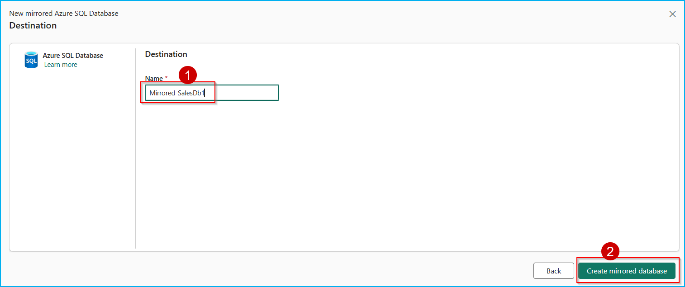
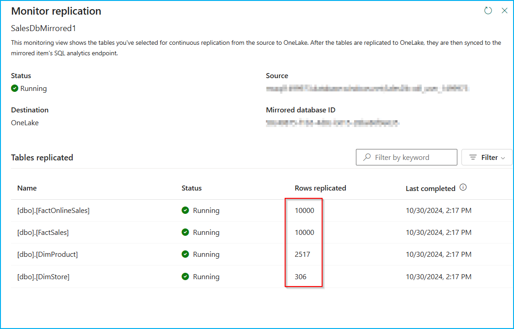
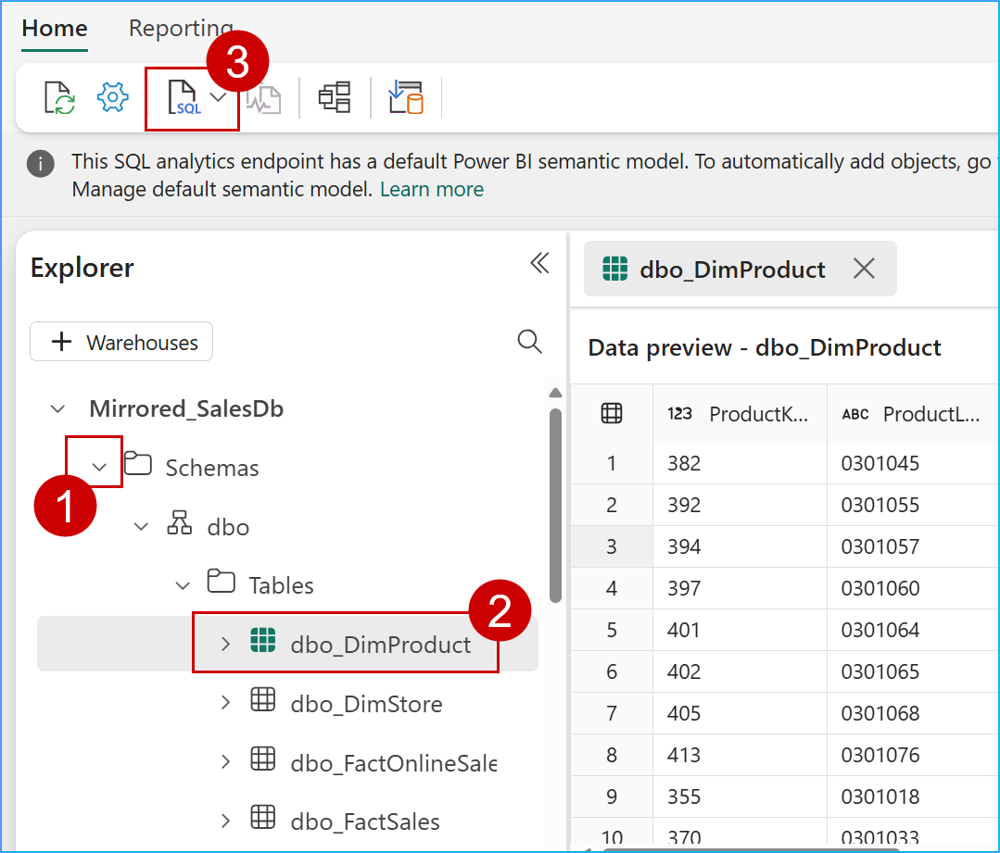
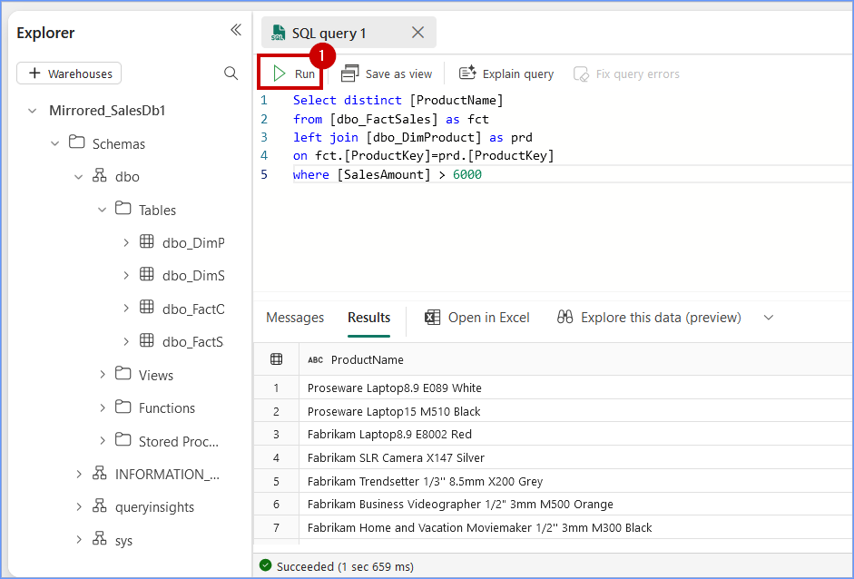

### Exercise 7:  Datawarehouse Experience (Optional)

### Task 7.1: Create Azure SQL DB Mirroring in Fabric

Mirroring in Fabric provides an easy experience to avoid complex ETL (Extract Transform Load) and integrate your existing Azure SQL Database estate with the rest of your data in Microsoft Fabric.

Litware had a lot of their marketing data in the Azure SQL DB, so Contoso used Database Mirroring to help further reduce their data movement and dependency on different systems. 

1. Navigate to the Microsoft Fabric tab on your browser 

```
https://app.powerbi.com
```
2. Click on **Workspaces** and select **<inject key= "WorkspaceName" enableCopy="false"/>**, and select **New item** from menu bar.


3. In the **New item** window, search for **SQL** in the saecrh bar then select **Mirrored Azure SQL Database...**.


4. When prompted to **Choose a database connection to get started**, look for **New sources** and select **Azure SQL database**.


5. In the **Server** field, paste <inject key="mssqlServer" enableCopy="false"/> , In **Database** field paste ```SalesDb```.

```BASH
<inject key="mssqlServer" enableCopy="false"/>
```
```
SalesDb
```


6.  Scroll down and select **Basic** for Authentication kind, enter "labsqladmin" as the Username, "Smoothie@2024" as the Password and click on the **Connect** button.

```
labsqladmin
```
```
Smoothie@2024
```


>**Note:** Close any pop-up that you see throughout the lab.

7. In the **Choose data** screen, you can select the tables to be mirrored into Fabric, then select the checkbox **Automatically mirror future tables** and click on **Connect** button.


8. Enter the name for your mirrored db as **Mirrored_SalesDb1** and click on Create **mirrored database** button.

```
Mirrored_SalesDb1
```



9. Click on **Monitor replication** button to track the replication status.


10. Wait until the **Rows replicated** statistics are displayed. If not refresh the **Monitor replication** tab as shown in the below screen. Now, Azure SQL DB has been successfully mirrored.



11. Close the **Monitor replication** window.

---

### Task 7.2: Analyze the mirrored Azure SQL Database data using T-SQL

Each mirrored Azure SQL database has an autogenerated SQL analytics endpoint that provides a rich analytical experience on top of the tables created by the mirroring process.

This means Contoso’s marketing data from SQL database is accessed seamlessly in Fabric with zero ETL, and it is always kept In Sync automatically in Fabric. Once the mirroring was up and running, Data Engineer, Eva, was able to access the tables in SQL Database and integrate the data in minutes. Let’s step into her shoes and see how it’s done!

1. Continuing from the priously created Mirrored SQL DB window, select **SQL analytics endpoint** from top right dropdown box.


2. You can select the mirrored tables to see data preview. Click on **New SQL query** button from the menu bar.



3. Copy below **SQL query** in query editor to explore mirrored data and perform your analysis. 

```BASH
Select distinct [ProductName] 
from [dbo_FactSales] as fct
left join [dbo_DimProduct] as prd
on fct.[ProductKey]=prd.[ProductKey]
where [SalesAmount] > 6000
```

4. Click on **Run**. 



---


Congratulations! You, as Data Engineers and Data Analysts have helped Contoso gain actionable insights from its disparate data sources, thereby contributing to future growth, customer satisfaction, and a competitive advantage.

In this lab we experienced the creation of a simple integrated, open and governed Data Lakehouse foundation using Modern Analytics with Microsoft Fabric and Azure Databricks.

In this lab we covered the following:

First, we explored the Data Engineering/Data Factory experience and learned how to create a Microsoft Fabric enabled workspace, build a Lakehouse, and ingest data into OneLake using Microsoft Fabric, including Delta tables, dataflows, and pipelines for both low-code and no-code data transformations.

Second, we explored the integration of Azure Databricks with Microsoft Fabric, including using Delta Live Tables for transformations, Unity Catalog for data governance, and analyzing mirrored Databricks data using T-SQL.

Third, we created a semantic model in Power BI and generate insights using Copilot in Microsoft Fabric.

Fourth, we explored real-time data ingestion using Eventstream and analyzed patterns, anomalies, and outliers with Copilot in KQL Database.

Fifth, we explored Streaming data using KQL DB for a Real-time Analytics experience. Here, we created a KQL Database, ingested real-time and historical data into KQL DB, analyzed patterns to uncover anomalies and outliers with the help of Copilot, and leveraged AI for data Q&A.

Finally, we leveraged Azure SQL Database mirroring in Fabric to analyze the mirrored data using T-SQL.
