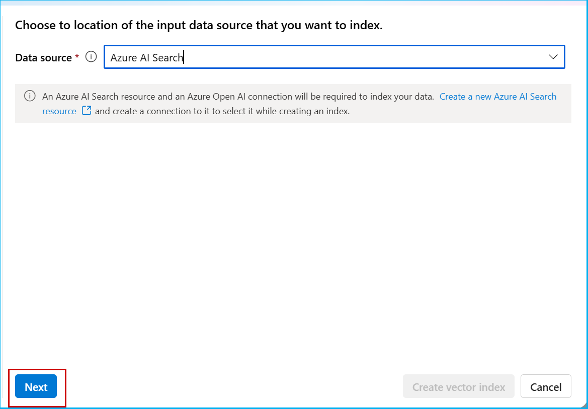
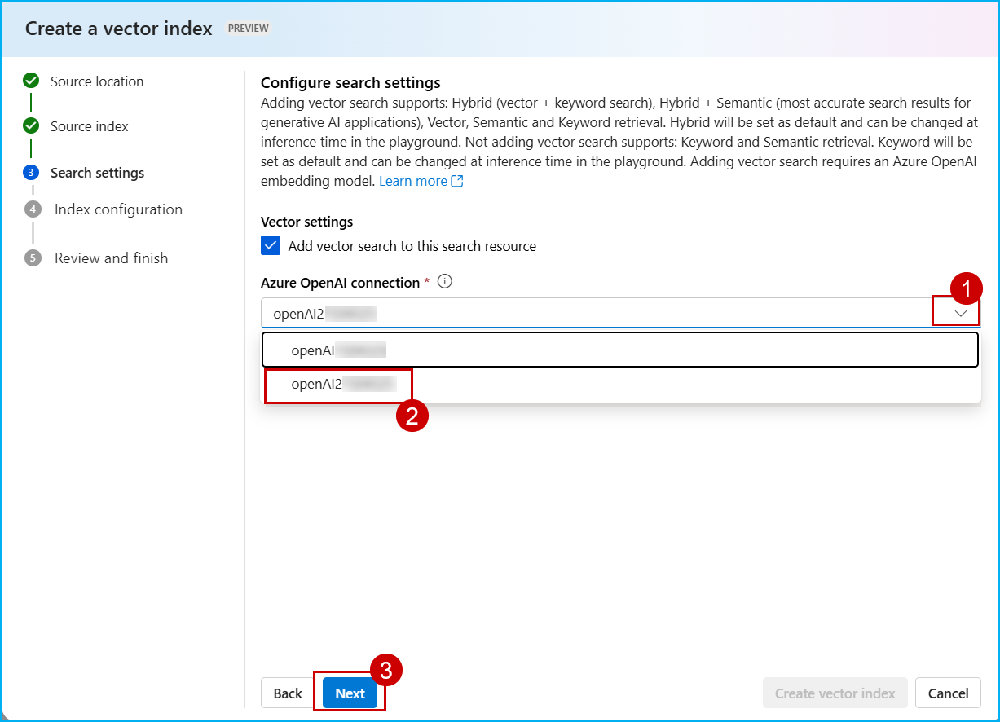
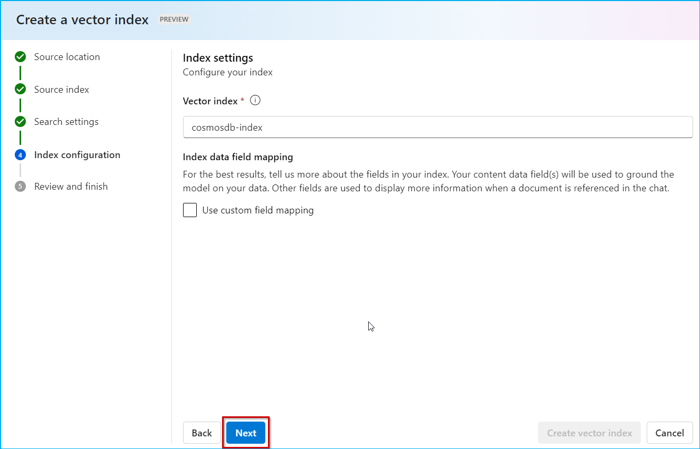
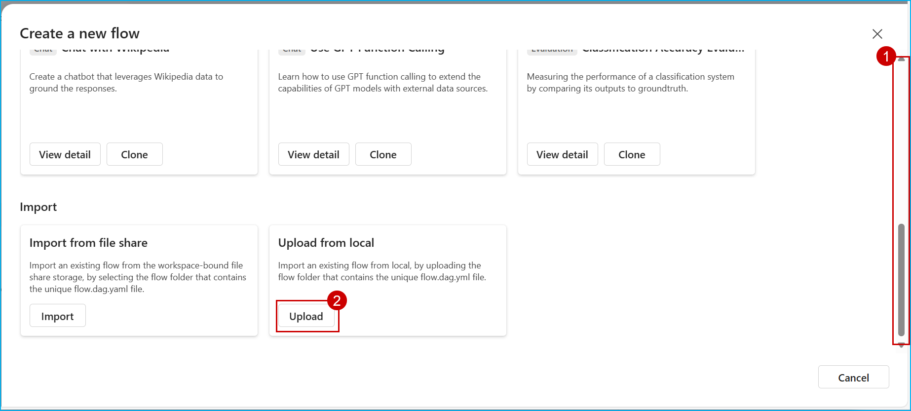
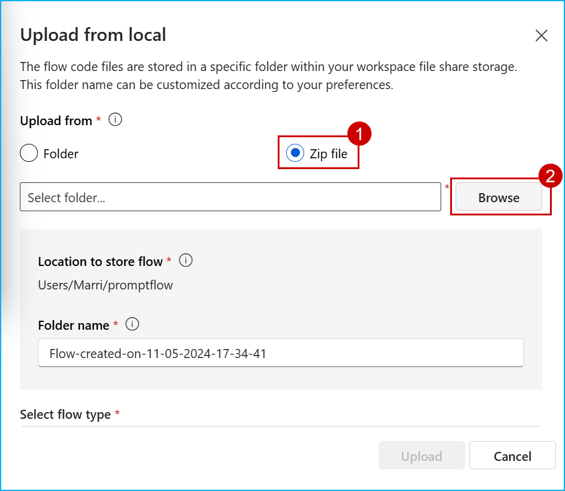
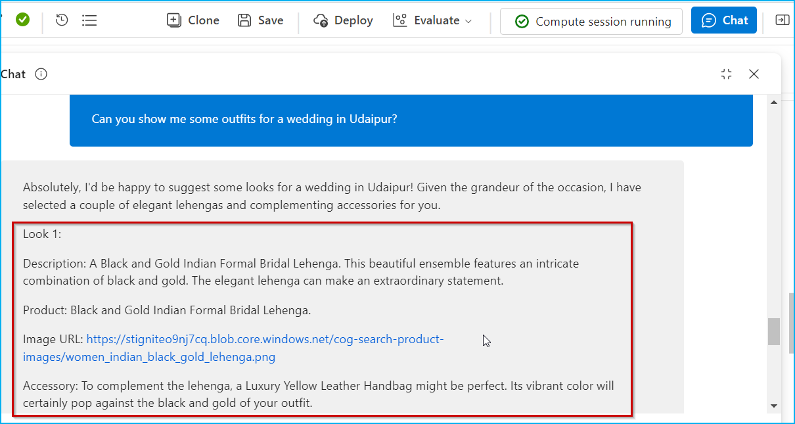

## Exercise 3: Building an AI-Powered Chatbot with Microsoft Fabric and Azure AI Studio

Contoso encountered a major issue with customer churn, especially among millennials. The executives at Contoso struggled to understand this customer segment and figure out how to earn their loyalty. Despite having extensive data from customer interactions, surveys, and market research, Contoso found it difficult to pinpoint the root cause of the churn and determine effective solutions.

The main problem was the lack of integration in their existing systems. This prevented Contoso's executives from utilizing their data for root cause analysis and strategic insights, which in turn, hampered their ability to improve marketing strategies, product offerings, and customer experiences.

To solve the data silos issue, Contoso implemented an advanced AI solution using Azure OpenAI, Azure AI Search, and Microsoft Fabric. Once the team discovered that millennials were leaving because they couldn't find products, they developed an Azure OpenAI-powered shopping assistant to help with product search and recommendations.

In this exercise, we will learn how they achieved this!

### Task 3.1: Integrate Fabric data with Azure AI Studio using Azure AI Search and Vector Indexing for Hybrid Search

Let’s step into the shoes of Eva, the Data Engineer, as she launches Azure AI Studio and leverages data stored in Microsoft OneLake as knowledge base.

1. Navigate back to the Microsoft Fabric tab on your browser.
 
2. Click on **Workspaces** and select **<inject key= "WorkspaceName" enableCopy="false"/>**.
    


3. Click on Filter and under Type select Lakehouse.
    


4. Click on the lakehouse.

>**Note:** There are 3 options for lakehouse, namely Lakehouse, Semantic model (Default) and SQL endpoint. Make sure you select the Lakehouse option.


5. Click on the three dots next to Files folder and select New subfolder.


6. Enter name of folder as input and click on Create button.


7. Click on the three dots next to the newly created folder input and select Upload, then Upload files.


8. In the Upload files window, click on the browse icon.


9. Copy the following path **C:\LabFiles\01_Pre_Day\artifacts\aistudio\input**, paste it into the **File Name** field, and press Enter on the keyboard.
10. Drag and select all the files in the folder and click on **Open** button.
   


11. Click on Upload button.


12. Wait for the files to get uploaded and click on close button.


13. Click on the three dots next to the **input** folder and click on **Properties** then click on **Copy to clipboard** button next of the URL path, save it on your notepad and remove **/input** from the end of the URL. This will be used in the further step.


14. In a new tab of your VM browser copy-paste the below URL in the new browser tab to open Azure AI Studio Project and click on the **prj-ignite..**.

|					                                       |
----------------------------------------------
| <inject key= "project" enableCopy="true"/> |
---------------------------------------------- 

>**Note:** Close any pop-up that appears on the screen throught the lab.


15. Click on the Expand icon, if the left navigation is hidden.


16. To connect with the data stored in Onelake, scroll down in the left navigation pane and click on Data.


>**Note:** Due to the screen resolution you might see a difference in the screenshot and actual lab interface, **Scroll up** to proceed with the next steps.

17. Under the connect, create, or manage your data , click on **+ New Data**


16. Click on the **+ New Connection**.


17. In the **Service** dropdown select **Microsoft OneLake**. 
18. In the **OneLake Artifact URL** field, paste the URL that you copied in the notepad earlier (step13). 
19. In the **Authentication method** dropdown select **Microsoft Entra ID based** 
20. In the **Connection name** field enter **fabric_onelake**. Finally click on the Create connection button.

>**Note:** Ensure that you have removed **/input** from the URL to avoid connection failure.


21. In the **Data source** dropdown select **fabric_onelake**, click on the **input** radio button and click on the **Next** button.


22. In the Data name field enter **input01** and click on **Create** button.


23. Once the connection is created, the **files** can be viewed under the input folder.


### Task 3.2: Establish Azure OpenAI, Azure AI Content Safety, and AI Search Connections in Azure AI Studio

Contoso integrated all of their data sources using Microsoft Fabric, including customer feedback, sales records, social media interactions, and encompassing internal company policy documents such as SOPs and research articles on customer behavior into Azure AI Search. This created a unified, searchable knowledge base.

Let’s step into Data Engineer, Eva’s shoes to see how.

1. In a new tab of your VM browser copy-paste the below URL in the new browser tab to open Azure AI Studio Project and click on the **hub-..**.

|					                                       |
----------------------------------------------
| <inject key= "project" enableCopy="true"/> |
---------------------------------------------- 


2. In Azure AI hub, expand the left **navigation pane**, select **Connected resources** under **Hub** section and click on the **+ New Connection** button.


3. Select **Azure OpenAI Service**.


4. You will find two Azure OpenAI resources, gpt-4 (1) and gpt-4o (2). Create a connection with both by clicking on the **Add connection** button.


5. Once the **OpenAI services are connected**, click on **Back to select an asset type**.


6. Click on **Azure AI Search**.


7. Click on **Add connection**.


8. Once the **AI Search is connected**, click on the **Close** button.


9. Notice that **Azure Open AI** and **Azure AI Search** connections are established successfully.


### Task 3.3: Create and configure a Vector Index in Azure AI Studio with Azure AI Search and OpenAI Connections

Contoso indexed OneLake data in Azure AI Studio to improve the efficiency of searching and retrieving large datasets, enabling faster, data-driven decision-making across the organization. This approach enhances accessibility, scalability, and workflow for data scientists and analysts, while also providing a better user experience and reducing operational costs..

Let’s see how Eva, the Data Engineer, indexed OneLake data in Azure AI Studio.

1. In the left navigation pane, click on **Go to Project** button.


2. Scroll down in the left navigation pane and click on **Data + indexes**, switch to **Indexes** tab then click on the **+ New index** button.


3. In the Data source dropdown, select **Azure AI search**.


4. Click on the **Next** button.



5. In the **Select Azure AI Search service** dropdown, select **srch..**.

6. In the **Select Azure AI Search index** dropdown, select **cosmosdb-index** and then click on the **Next** button.

>**Note:** If you get an error like "Unable to load search service indexes.Request failed with status code 403." please proceed by selecting Index.


7. In the **Azure OpenAI connection** dropdown, select **<inject key= "openai2" enableCopy="false"/>** and then click on the Next button.



8. Click on the **Next** button.



9. Click on the **Create vector index** button.


>**Note:** Please wait for the index to load. It takes approximately 1-2 minutes.

10. The screen displayed will resemble the image below, featuring the message **Index not found**. This is normal. Please wait for a few moments, then click on **Data + indexes**.


11. Click on Indexes tab and check the Status which will show as Ready. Continue with the next task.


### Task 3.4: Setup and use Prompt Flow in Azure AI Studio

Prompt flow in Azure AI Studio offers a comprehensive, streamlined environment for creating AI applications. It provides a visual interface for orchestrating flows, and enables iterative prompt engineering. Azure AI Studio includes built-in evaluation tools, seamless deployment options, and integration with Azure's ecosystem. It also offers enterprise-level security and scalability, making it ideal for developing, testing, and deploying sophisticated AI solutions efficiently. Let’s explore how Contoso deployed and tested a Prompt flow.


1. Click on **Prompt flow** from the left navigation pane and then click on the **+ Create** button.


2. Scroll down and click on the **Upload** button in the Upload from local section.



3. Click on the **Zip file** radio button and then click on **Browse**.



4. Copy paste the following path **C:\LabFiles\01_Pre_Day\artifacts\aistudio** in the **File name** field and then click on **Open** button.


5. Click on **shopping-assistant-prompt-flow** and then click on the **Open** button.


6. In the Select flow type dropdown, select **Chat flow** and then click on the **Upload** button.


>**Note:** If clicking on the Upload button doesn't redirect you to the Prompt Flow screen, click the Upload button again twice or thrice. If it still doesn't work, refresh the page and try uploading again.

7. Click on the **Start compute session** button.

>**Note:** It will take approximately 2-3 minutes to start the compute session. Please wait for some time.


8. Scroll down to the **lookup** node in the Prompt flow graph and click on it.

9. Click on the **Validate and prase input** button.

10. Once it is validated, click on the edit icon (shaped like a pencil) to modify the value for **mlindex_content** as shown in the below screenshot.


11. Click on the **acs_index_connection** dropdown and select the **srch....**.

12. Click on the **acs_index_name** dropdown and select the **cosmosdb-index**.

13. Click on the **embedding_type** dropdown and select the **Azure OpenAI**.

14. Click on the **aoai_embedding_connection** dropdown and select the **<inject key= "openai2" enableCopy="false"/>**. Make sure to select the resource with the suffix starting with 2.

15. Click on the **Save** button.


16. Click on **prompt_for_looks** in the Graph, collapse **Prompt** and click on the **Validate and prase input** button in the Input sections.


17. Once it is validated, click on the **Connection** dropdown and then select **<inject key= "openai" enableCopy="false"/>**.

>**Note:** Please ensure that you select <inject key= "openai" enableCopy="false"/> only.


18. Click on **max_token**, remove the preset token, and set it to **100**.


19. Click on the **Chat** button.


20. Replace the default **prompt** and paste the **prompt** given below in chat box.

```
Can you show me some Indian dresses for a wedding in Udaipur?
```

21. Click on the **send** icon.


21. Observe the **response**.



Once the Prompt flow is deployed as an endpoint, It can be consumed in the webapplication. Let's see how the response look like in the webapp.

22. Open a new tab and Copy-paste the below **URL** in the broswer address bar, and then press **Enter**.

|					                                                     |
-----------------------------------------------------------
| <inject key= "shoppingcopilotwebapp" enableCopy="true"/> |
------------------------------------------------------------ 


23. Click on the **terms and conditions checkbox** and then click on the **Login** button.


24. Click on the **Copilot icon** at the bottom right of the page.


25. Click on any of the **pre-populated questions**.


26. Observe the **response**.


With their new Shopping Copilot, Contoso was able to provide their customers with an online shopping experience that has an in-store feel. This simulates a personalized shopping experience that helps increase customers’ engagement with enhanced data insights.
